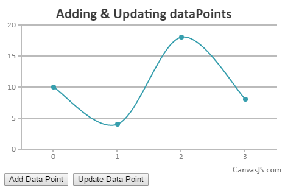

###更新图表配置/数据
--------
####概述 - 更新图表选项
在入门部分中，我们解释了创建图表和自定义图表的基本知识。我们也一小部分是更新图表。在这一节中我们将解释更多关于如何更新图表和提高性能、避免内存泄漏的一些最佳做法，

为了更新图表，您需要先更改对象属性，然后调用`chart.render()`  
您可以访问这些对象属性通过`chart.options`如下图所示。
```
chart.options.title.text = "Update Chart Title";
chart.options.data[0].dataPoints.push({y: 23}); // 增加一个点到数组中
chart.options.data[0].dataPoints[3].y = 27;  // 更新现在的数组点
```

####用按钮增加/更新一个点的例子
```
<!DOCTYPE html>
<html>
<head> 
<script type="text/javascript" src="/assets/script/jquery-1.11.1.min.js"></script>
<script type="text/javascript" src="/assets/script/canvasjs.min.js"></script> 
<script type="text/javascript">
window.onload = function () {
    var chart = new CanvasJS.Chart("chartContainer", { 
        title: {
            text: "Adding & Updating dataPoints"
        },
        data: [
        {
            type: "spline",
            dataPoints: [
                { y: 10 },
                { y:  4 },
                { y: 18 },
                { y:  8 }   
            ]
        }
        ]
    });
    chart.render(); 

    $("#addDataPoint").click(function () {

    var length = chart.options.data[0].dataPoints.length;
    chart.options.title.text = "New DataPoint Added at the end";
    chart.options.data[0].dataPoints.push({ y: 25 - Math.random() * 10});
    chart.render();

    });

    $("#updateDataPoint").click(function () {

    var length = chart.options.data[0].dataPoints.length;
    chart.options.title.text = "Last DataPoint Updated";
    chart.options.data[0].dataPoints[length-1].y = 15 - Math.random() * 10;
    chart.render();

    });
}
</script>
</head>  
<body>  
<div id="chartContainer" style="width:100%; height:280px"></div>  
<button id="addDataPoint">Add Data Point</button>  
<button id="updateDataPoint">Update Data Point</button>  
</body>
</html>
```


**注意**
* 你应该记住在设置/更新完选项后调用`chart.render()`方法 -- 试着在调用`chart.render()`方法前去一次性更新所有
* canvasjs性能的部分也是很不错的！所有，你甚至可以每隔100ms更新图表，虽然这样的需求一般很少。

####下面几个例子
```
chart.options.title.text = "Update Chart Title";
 
chart.options.data = [array]; // 设置点数组
 
chart.options.data[0] = {object}; // 设置/替换点数组
 
chart.options.data.push({object}); // 增加一个新的点
 
chart.options.data[0].dataPoints = [array]; // 设置/替换点数组
 
chart.options.data[0].dataPoints.push({y: 23}); // 增加一个新的点
 
chart.options.data[0].dataPoints[3] = {y: 23};  // 设置/替换点数组
 
chart.options.data[0].dataPoints[3].y = 27;  // 更新一个点
 
chart.options.axisY.maximum = 60; // 设置Y轴的最大值
```

**小建议**
* 不必每次通过`chart`对象访问属性，你也可以参照必需的属性，必要时直接改变它的值。例如，您创建一个数据点数组，后来通过做`dataPoint.push`添加新的数据点到它（`{Y：28}`）代替`chart.options.data[0].dataPoints.push`（`{Y：28}`）

####创建动态图表
创造一个动态图表最重要的是，仅创建一个图表，然后更新属性：如增加一个新点，等等。
例如：如果你通过Ajax每秒得到一个新的数据点，你应该在Ajax调用之前创建图表，然后将响应得到的点数据加到图表中，强烈建议不要每次得到一个新的数据点就创建一次图表。
```
<!DOCTYPE HTML>
<html>
<head>
<script type = "text/javascript" >
window.onload = function () {
    var dataPoints = [{y : 10}, {y : 13}, {y : 18}, {y : 20}, {y : 17}];
    var chart = new CanvasJS.Chart("chartContainer", {
            title : {
                text : "Dynamic Data"
            },
            data : [{
                    type : "spline",
                    dataPoints : dataPoints
                }
            ]
        });

    chart.render();
    
    var yVal = 15, updateCount = 0;
    var updateChart = function () {

        yVal = yVal + Math.round(5 + Math.random() * (-5 - 5));
        updateCount++;
        
        dataPoints.push({
            y : yVal
        });
        
        chart.options.title.text = "Update " + updateCount;
        chart.render();    
        
    };

    // update chart every second
    setInterval(function(){updateChart()}, 1000);
}   
</script>
<script type = "text/javascript" src = "/assets/script/canvasjs.min.js" >  </script>
</head>
<body>
<div id = "chartContainer" style = "height: 300px; width: 100%;" />
</body>
</html>
```


