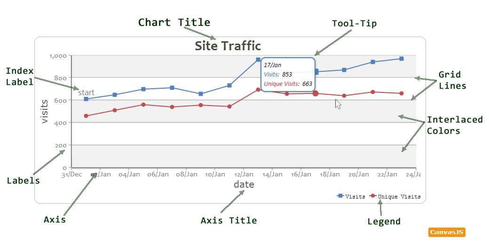

###图表元素
------
####概述 - CanvasJS中可用图表元素
下面这张图片展示了所有基本元件的图表。

------
####Chart Title(图表标题)
来描述图表标题。

####Legend(图例)
图表图例，你可以放在8个不同的地方

####Grid Lines(网格线)
使用网格线，提高图表的可读性。您可以显示水平和垂直网格线。

####Tool-Tip(工具提示)
显示工具提示时数据点/dataSeries的附加信息。

####Label(标签)
一个由用户设置或自动产生的轴标签。

####Axis(轴)
X和Y轴的图表。CanvasJS支持一个X轴和两个Y轴

####Axis Title(轴标题)
一个轴的标题。每个轴都有自己的title属性。

####Index Label(标签序号)
标签序号可用于显示的数据点的附加信息。其取向可以是水平或垂直的

####Interlaced Color(颜色交错)
颜色的交替带，关于绘图区出现。

在接下来的章节中，你可以更加了解这些元素和定制它们。

