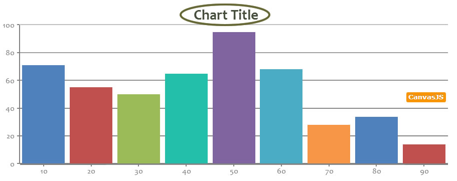
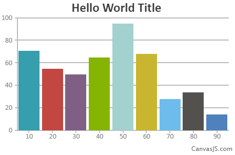
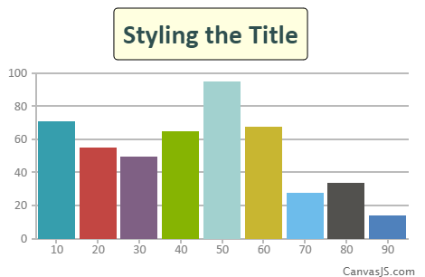
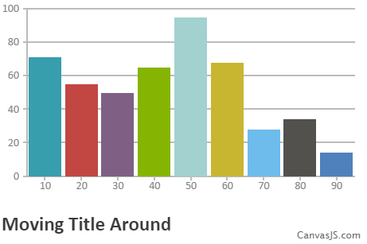
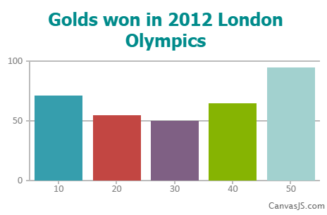

###标题
------

####概述 - 展示&自定义图表标题
图表标题通常出现在主绘图区的上方，提供简要的图表描述。标题提供了内容、外观和图表标题位置的相关属性


####Syntax(规则)
用作描述图表的标题
```
var  chart =  new  CanvasJS.Chart("container",
{
 .
 .
 title:{
     text: "Chart Title"
    // more attributes 
 },
 .
 . 
});
chart.render();
```
####创建基本标题
`text`是最重要的标题属性，任何文本都能写在标题属性中,下面的例子中，用`title`对象有简单的文本属性。
```
<!DOCTYPE HTML>
<html>
<head>  
  <script type="text/javascript">
  window.onload = function () {
    var chart = new CanvasJS.Chart("chartContainer",
    {
      title:{
      text: "Hello World Title"  //**Change the title here
      },
      data: [
      {        
        type: "column",
        dataPoints: [
        { x: 10, y: 71 },
        { x: 20, y: 55},
        { x: 30, y: 50 },
        { x: 40, y: 65 },
        { x: 50, y: 95 },
        { x: 60, y: 68 },
        { x: 70, y: 28 },
        { x: 80, y: 34 },
        { x: 90, y: 14}
        ]
      }
      ]
    });

    chart.render();
  }
  </script>
 <script type="text/javascript" src="/assets/script/canvasjs.min.js"></script></head>
<body>
  <div id="chartContainer" style="height: 300px; width: 100%;">
  </div>
</body>
</html>
```


-----
####美化标题
这里有一些我们能设置在对象的属性，这些属性能够美化我们想要的样式

|  属性                        |    类型    |  默认     |   选项​​/示例   |
| ---------------------------- |:----------:|:---------:|:-------------:|
|  backgroundColor             |   string   |  null     |  "red"        |
|  borderColor                 |   string   | "black"   |  "red"        |
|  borderThickness             |   number   |   0       |   2,6         |
|  cornerRadius                |   number   |   0       |   5,8         |
|  fontColor                   |   string   | "black"   |  "red"        |
|  fontFamily                  |   string   | "calibri" |  "arial"      |
|  fontSize                    |   number   |   20      |   25          |
|  fontStyle                   |   string   | "normal"  |  "normal"     |
|  fontWeight                  |   string   | "normal"  |  "lighter"    |
|  margin                      |   number   |   5       |   10          |
|  padding                     |   number   |   0       |   5           |
|  wrap                        |   Boolean  |  true     |   true,false  |
|  maxWidth                    |   Number   |  auto     |   200         |
|  dockInsidePlotArea          |   Boolean  |  false    |   true,false  |

```
<!DOCTYPE HTML>
<html>
<head>  
  <script type="text/javascript">
  window.onload = function () {
    var chart = new CanvasJS.Chart("chartContainer",
    {
      title:{
        text: "Styling the Title",  
        fontColor: "#2f4f4f",
        fontSize: 30,
        padding: 10,
        margin: 15,
        backgroundColor: "#FFFFE0",
        borderThickness: 1,
        cornerRadius: 5,
        fontWeight: "bold"
      },
      data: [
      {        
        type: "column",
        dataPoints: [
       
        { x: 10, y: 71 },
        { x: 20, y: 55},
        { x: 30, y: 50 },
        { x: 40, y: 65 },
        { x: 50, y: 95 },
        { x: 60, y: 68 },
        { x: 70, y: 28 },
        { x: 80, y: 34 },
        { x: 90, y: 14}
       
        ]
      }
      ]
    });

    chart.render();
  }
  </script>
 <script type="text/javascript" src="/assets/script/canvasjs.min.js"></script></head>
<body>
  <div id="chartContainer" style="height: 300px; width: 100%;">
  </div>
</body>
</html>
```


####标题对齐方式
标题可以通过`verticalAlign`和`horizo​​ntalAlign`的属性组合定位到9个不同的位置，下面是组合表

|  选项 |   水平对齐    |  垂直对齐   |
| ----- |:-------------:|:-----------:|
|  1    |   left        |   top       |
|  2    |   left        |   center    |
|  3    |   left        |   bottom    |
|  4    |   center      |   top       |
|  5    |   center      |   center    |
|  6    |   center      |   bottom    |
|  7    |   right       |   top       |
|  8    |   right       |   center    |
|  9    |   right       |   bottom    |

你可以尝试上面的所有组合

```
<!DOCTYPE HTML>
<html>
<head>  
  <script type="text/javascript">
  window.onload = function () {
    var chart = new CanvasJS.Chart("chartContainer",
    {
       title:{
        text: "Moving Title Around",  
        verticalAlign: "bottom", // "top", "center", "bottom"
        horizontalAlign: "left" // "left", "right", "center"
      },

      data: [
      {        
        type: "column",
        dataPoints: [
        { x: 10, y: 71 },
        { x: 20, y: 55},
        { x: 30, y: 50 },
        { x: 40, y: 65 },
        { x: 50, y: 95 },
        { x: 60, y: 68 },
        { x: 70, y: 28 },
        { x: 80, y: 34 },
        { x: 90, y: 14}
        ]
      }
      ]
    });

    chart.render();
  }
  </script>
  <script type="text/javascript" src="/assets/script/canvasjs.min.js"></script>
</head>
<body>
  <div id="chartContainer" style="height: 300px; width: 100%;">
  </div>
</body>
</html>
```


--------

####结合起来
结合所有的标题属性能够生成一个漂亮的标题，试试自己的风格吧！
```
<!DOCTYPE HTML>
<html>
<head>  
  <script type="text/javascript">
  window.onload = function () {
    var chart = new CanvasJS.Chart("chartContainer",
    {
      title:{
        text: "Golds won in 2012 London Olympics", 
        fontWeight: "bolder",
        fontColor: "#008B8B",
        fontFamily: "tahoma",        
        
        fontSize: 25,
        padding: 10        
      },
      data: [
      {        
        type: "column",
        dataPoints: [
        { x: 10, y: 71 },
        { x: 20, y: 55},
        { x: 30, y: 50 },
        { x: 40, y: 65 },
        { x: 50, y: 95 }       
        ]
      }
      ]
    });

    chart.render();
  }
  </script>
 <script type="text/javascript" src="/assets/script/canvasjs.min.js"></script></head>
<body>
  <div id="chartContainer" style="height: 300px; width: 100%;">
  </div>
</body>
</html>
```
