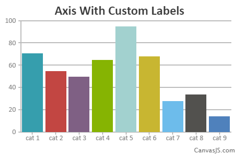

###使用数据

------
####概述 - 在图表使用数据
本节介绍如何将数据添加到图表。所有绘制的数据应该被添加到数组中，数组也称的“data”是图表选项的属性。在数组中的每个元素是称为dataSeries的一个对象且属于与其它元素相关的逻辑组。个别数据元素/点称为数据点，在整个文档我们使用术语dataSeries和系列（为简便起见）互换。

####dataSeries
该数据数组中的每个元素都是一个dataSeries对象。dataSeries是相关数据点的逻辑分组并作为整体它们呈现的图表。dataSeries中，可以定义要呈现一组给定的数据元素是什么类型的图表。每个dataSeries可以呈现不同的图表类型。在dataSeries用户可以定义都喜欢的`type`, `name`, `legendText` ,`dataPoints` etc.dataSeries的dataSeries级属性还可以定义得到应用到所有它所包含的数据点元素的属性-它可以依次覆盖由各个数据点。
#####下面的用法显示dataSeries的对象数据数组。
```
var  chart =  new  CanvasJS.Chart("container",
{
  .
  .
  .
  data:[ 
  {// dataSeries 1
   type: "column",
   dataPoints:[ //array of dataPoint
    {x:1, y:5} //dataPoint
    {x:2, y:6} //dataPoint
    {x:3, y:7} //dataPoint
   ]
  },
 
  {// dataSeries 2 
   type: "line",
   dataPoints:[
    {x:1, y:8} //dataPoint
    {x:2, y:9} //dataPoint
    {x:3, y:4} //dataPoint
   ]
  },
.
 
],
.
. 
});
chart.render();
```
####dataPoints
每一个在图表上要绘制的值被称为一个数据点。将每个数据点添加到数组称为数据点是dataSeries。你应该记住最常用的数据点属性是X，Y和label。
这里是你如何添加数据点到dataSeries。
```
dataPoints : [ 
   { x: 10, y: 15, label: "apple"  }, //dataPoint
   { x: 20, y: 8, label: "mango"  }, 
   { x: 30, y: 10, label: "orange"  }, 
   { x: 40, y: 12, label: "banana"  }, 
],
```
**注意**
* 像toolTipContent，颜色等属性可以在两个dataSeries和数据点级别设置。在这种情况下，设置数据点的值将覆盖在dataSeries级别中提供的。

####添加数据点
每个数据点可以是任何值。一些能被绘制的只能是y值作为数据点。如果没有提供x值，它们会自动按顺序设置从零开始。
```
<!DOCTYPE HTML>
<html>
<head>  
  <script type="text/javascript">
  window.onload = function () {
    var chart = new CanvasJS.Chart("chartContainer",
    {
      title:{
      text: "Adding dataPoints"  
      },
      data: [
      {        
        type: "column",
        dataPoints: [
        { y: 71 },
        { y: 55},
        { y: 50 },
        { y: 65 },
        { y: 95 },
        { y: 68 },
        { y: 28 },
        { y: 34 },
        { y: 14}
      
        ]
      }
      ]
    });

    chart.render();
  }
  </script>
 <script type="text/javascript" src="/assets/script/canvasjs.min.js"></script></head>
<body>
  <div id="chartContainer" style="height: 300px; width: 100%;">
  </div>
</body>
</html>
```


-----

####数据点x值
数据点可以通过在数据点设置x值定位在axisX。x值可以是数值或日期时间值。
```
<!DOCTYPE HTML>
<html>
<head>  
  <script type="text/javascript">
  window.onload = function () {
    var chart = new CanvasJS.Chart("chartContainer",
    {
      title:{
      text: "Placing dataPoint on axisX"
      },
      data: [
      {        
        type: "column",
        dataPoints: [
        { x: 10, y: 71 },
        { x: 22, y: 55},
        { x: 31, y: 50 },
        { x: 44, y: 65 },
        { x: 50, y: 95 },
        { x: 64, y: 68 },
        { x: 72, y: 28 },
        { x: 84, y: 34 },
        { x: 90, y: 14}
      
        ]
      }
      ]
    });

    chart.render();
  }
  </script>
 <script type="text/javascript" src="/assets/script/canvasjs.min.js"></script></head>
<body>
  <div id="chartContainer" style="height: 300px; width: 100%;">
  </div>
</body>
</html>
```


-----

####在数据点标签
标签是出现在axisX值。如果没有提供，它需要x值的标签。我们也可以在axisX添加自定义标签。
```
<!DOCTYPE HTML>
<html>
<head>  
  <script type="text/javascript">
  window.onload = function () {
    var chart = new CanvasJS.Chart("chartContainer",
    {  
      title: {
        text: "Axis With Custom Labels"      
      },
      data: [
      {             
        type: "column",
        dataPoints: [
       
        { y: 71, label: "cat 1" },
        { y: 55, label: "cat 2" },
        { y: 50, label: "cat 3" },
        { y: 65, label: "cat 4" },
        { y: 95, label: "cat 5" },
        { y: 68, label: "cat 6" },
        { y: 28, label: "cat 7" },
        { y: 34, label: "cat 8" },
        { y: 14, label: "cat 9" }
        ]
      }
      ]
    });

    chart.render();
  }
  </script>
  <script type="text/javascript" src="/assets/script/canvasjs.min.js"></script>
</head>
<body>
  <div id="chartContainer" style="height: 300px; width: 100%;">
  </div>
</body>
</html>
```


------

####数据点的标签序号
索引标签值上方或下方的实际数据点。
```
<!DOCTYPE HTML>
<html>
<head>  
  <script type="text/javascript">
  window.onload = function () {
    var chart = new CanvasJS.Chart("chartContainer",
    {
      title:{
       text: "Index Labels on dataPoints"   
      },
      data: [
      {        
        type: "column",
        dataPoints: [
        
        { x: 10, y: 71},
        { x: 20, y: 55},
        { x: 30, y: 50 },
        { x: 40, y: 65 },
        { x: 50, y: 125, indexLabel: "high" },
        { x: 60, y: 68 },
        { x: 70, y: 28 },
        { x: 80, y: 34 },
        { x: 90, y: 14,  indexLabel: "low" }
        ]
      }
      ]
    });

    chart.render();
  }
  </script>
  <script type="text/javascript" src="/assets/script/canvasjs.min.js"></script>
</head>
<body>
  <div id="chartContainer" style="height: 300px; width: 100%;">
  </div>
</body>
</html>
```


-----

####整合起来
现在，我们可以应用上述概念和定义的标题来与我们的第一个完整的图。
```
<!DOCTYPE HTML>
<html>
<head>  
  <script type="text/javascript">
  window.onload = function () {
    var chart = new CanvasJS.Chart("chartContainer",
    {
       title:{
        text: "Golds won in 2012 London Olympics", 
        fontWeight: "bolder",
        fontColor: "#008B8B",
        fontfamily: "tahoma",        
        fontSize: 25,
        padding: 10        
      },

      data: [
      {        
        type: "column",
        dataPoints: [
         {label: "US", y: 46 },
         {label: "China", y: 38},
         {label: "Britain", y: 29},
         {label: "Russia", y: 24 },
         {label: "South Korea", y: 13 },
         {label: "Germany", y: 11 },
         {label: "france", y: 11},
         {label: "Hungary", y: 8 },
         {label: "Australia", y: 7 },
         {label: "Japan", y: 7 }      
      ]
    }

      ]
    });

    chart.render();
  }
  </script>
 <script type="text/javascript" src="/assets/script/canvasjs.min.js"></script></head>
<body>
  <div id="chartContainer" style="height: 300px; width: 100%;">
  </div>
</body>
</html>
```
