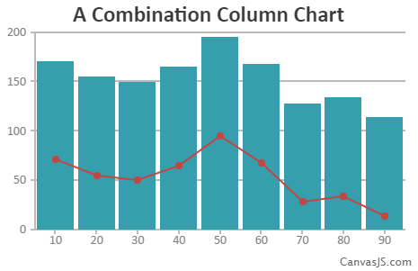
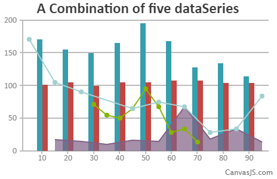

###组合图表
-------

####概述 - 显示多种数据的图表
您可以结合不同类型的图表，形成一个组合图表。例如，一个图表可以是面积、行、列等的结合。被渲染的图表应该按在数组的顺序依次出现。结果是，一些数据可能与其它相同位置的数据重叠。
圆饼图和圆环图不能与任何其他图表类型组合。

**笔记**
 您可以将任何类型的图表类型，除了以下两个例外：
 * 饼图和圆环不能与任何其他类型的图表相结合
 * 条形图、堆积条形图和百分率条形图不能与任何其他类型的组合。
 
####基本组合图
这里是行号和列图表的组合，尝试创建其他组合。
```
<!DOCTYPE HTML>
<html>
<head>  
  <script type="text/javascript">
  window.onload = function () {
    var chart = new CanvasJS.Chart("chartContainer",
    {
      title:{
        text: "A Combination Column Chart"
      
      },   
      data: [{        
        type: "column",
        dataPoints: [
        { x: 10, y: 171 },
        { x: 20, y: 155},
        { x: 30, y: 150 },
        { x: 40, y: 165 },
        { x: 50, y: 195 },
        { x: 60, y: 168 },
        { x: 70, y: 128 },
        { x: 80, y: 134 },
        { x: 90, y: 114}
        ]
      },
      {        
        type: "line",
        dataPoints: [
        { x: 10, y: 71 },
        { x: 20, y: 55},
        { x: 30, y: 50 },
        { x: 40, y: 65 },
        { x: 50, y: 95 },
        { x: 60, y: 68 },
        { x: 70, y: 28 },
        { x: 80, y: 34 },
        { x: 90, y: 14}
        ]
      }
        
      ]
    });

    chart.render();
  }
  </script>
  <script type="text/javascript" src="/assets/script/canvasjs.min.js"></script>
</head>
<body>
  <div id="chartContainer" style="height: 300px; width: 100%;">
  </div>
</body>
</html>
```


-----

####图表拥有5个数据
这里有两列、一个面试和两个折线图的组合图。
在一些情况下图表之间彼此重叠，应该记住被渲染的图表应该按在数组的顺序依次出现。
```
<!DOCTYPE HTML>
<html>
<head>  
  <script type="text/javascript">
  window.onload = function () {
    var chart = new CanvasJS.Chart("chartContainer",
    {
      title:{
        text: "A Combination of five dataSeries"
      
      },   
      data: [{        
        type: "column",
        dataPoints: [
        { x: 10, y: 171 },
        { x: 20, y: 155},
        { x: 30, y: 150 },
        { x: 40, y: 165 },
        { x: 50, y: 195 },
        { x: 60, y: 168 },
        { x: 70, y: 128 },
        { x: 80, y: 134 },
        { x: 90, y: 114}
        ]
      },{        
        type: "column",
        dataPoints: [
        { x: 10, y: 101 },
        { x: 20, y: 105},
        { x: 30, y: 100 },
        { x: 40, y: 105 },
        { x: 50, y: 105 },
        { x: 60, y: 108 },
        { x: 70, y: 108 },
        { x: 80, y: 104 },
        { x: 90, y: 104}
        ]
      },{        
        type: "area",
        dataPoints: [
        { x: 15, y: 17 },
        { x: 25, y: 15},
        { x: 35, y: 10 },
        { x: 45, y: 16 },
        { x: 55, y: 15 },
        { x: 65, y: 68 },
        { x: 75, y: 18 },
        { x: 85, y: 34 },
        { x: 95, y: 14}
        ]
      },
        
      {        
        type: "line",
        dataPoints: [
        { x: 30, y: 71 },
        { x: 35, y: 55},
        { x: 40, y: 50 },
        { x: 45, y: 65 },
        { x: 50, y: 95 },
        { x: 55, y: 68 },
        { x: 60, y: 28 },
        { x: 65, y: 34 },
        { x: 70, y: 14}
        ]
      },
              {        
        type: "line",
        dataPoints: [
        { x: 5, y: 171 },
        { x: 15, y: 105},
        { x: 25, y: 90 },
        { x: 45, y: 65 },
        { x: 55, y: 75 },
        { x: 65, y: 68 },
        { x: 75, y: 28 },
        { x: 85, y: 34 },
        { x: 95, y: 84}
        ]
      }
      ]
    });

    chart.render();
  }
  </script>
  <script type="text/javascript" src="/assets/script/canvasjs.min.js"></script>
</head>
<body>
  <div id="chartContainer" style="height: 300px; width: 100%;">
  </div>
</body>
</html>
```
